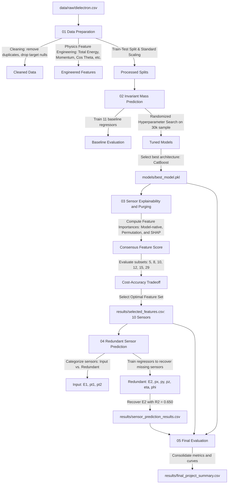

# CERN Electron Collision Sensor Data Explainability and Purging

This project implements a machine learning and physics-inspired pipeline using the CERN Dielectron Dataset. The goal is to predict the invariant mass of dielectron events, analyze sensor explainability using a consensus ranking framework, optimize sensor configurations, and recover redundant sensor readings.

---

## Project Objectives

1. Predict the invariant mass of two electrons from collision kinematics.
2. Rank sensor importances using a consensus scoring framework.
3. Determine the optimal tradeoff between sensor count and prediction accuracy.
4. Predict missing or degraded sensor values using other available sensors.

---

## Project Structure

- **data/raw/dielectron.csv**: Raw collision events dataset containing 100k records.
- **data/processed/**: Processed training, testing, and scaled feature matrices.
- **models/best_model.pkl**: Best trained regression model (CatBoost) saved for inference.
- **results/**: CSV outputs containing baseline model evaluations, consensus feature rankings, sensor purging curves, and redundancy prediction metrics.
- **notebooks/**:
  - **01_Data_Preparation.ipynb**: Data cleaning, EDA, feature engineering, and preparation.
  - **02_Invariant_Mass_Prediction.ipynb**: Training baseline regression models, tuning, and selection of the best model.
  - **03_Sensor_Explainability_and_Purging.ipynb**: Global, permutation, and SHAP feature importance analysis, leading to optimal sensor subset selection.
  - **04_Redundant_Sensor_Prediction.ipynb**: Regressor training to predict redundant sensor values from selected sensors.
  - **05_Final_Evaluation.ipynb**: Consolidating performance tables, plots, and summaries for all pipeline components.

### Pipeline Workflow Diagram

---

## Notebook Analysis

### 01 Data Preparation

#### Q: What were the cleaning steps performed on the raw data?
A: Trailing whitespaces in column names were stripped. Duplicate observations were identified and removed. Rows containing missing values for any feature (including the target M) were dropped.

#### Q: Why did we drop missing target values instead of imputing them?
A: Imputing missing target values with statistical measures (like the median) introduces artificial bias and noise into the ground truth labels. Since there were only 85 records with missing target values out of 100k events, dropping them preserves target label integrity without significantly reducing dataset size.

#### Q: What physics-inspired features were engineered?
A: Several features were calculated from raw components:
- **Total Energy**: Sum of electron energies (E1 + E2).
- **Total Momentum**: Magnitude of the total momentum vector: sqrt((px1+px2)^2 + (py1+py2)^2 + (pz1+pz2)^2).
- **Momentum1 and Momentum2**: Magnitudes of individual electron momentum vectors.
- **Total PT**: Sum of transverse momenta (pt1 + pt2).
- **Energy, Momentum, and PT Differences**: Absolute differences between particle measurements.
- **Eta and Phi Differences**: Spatial distance measurements between pseudorapidity (eta) and azimuthal angle (phi) coordinates.
- **Charge Product and Difference**: Physical features representing the charge combinations (Q1 * Q2) and (abs(Q1 - Q2)).
- **Cos Theta**: Cosine of the angle between the two electrons: dot(p1, p2) / (norm(p1) * norm(p2)).

#### Q: Why did we scale the features?
A: Linear regression, Ridge, Lasso, and ElasticNet models are sensitive to the scale of input features. Standardizing them to have a mean of 0 and variance of 1 ensures stable coefficients and prevents features with larger magnitudes from dominating the loss function.

---

### 02 Invariant Mass Prediction

#### Q: Which regression models were evaluated?
A: Eleven regression models were trained: Linear Regression, Ridge, Lasso, ElasticNet, Decision Tree, Random Forest, Extra Trees, Gradient Boosting, XGBoost, LightGBM, and CatBoost.

#### Q: How did we optimize the hyperparameter tuning phase to run efficiently?
A: Tuning tree ensemble algorithms (Extra Trees, LightGBM, and XGBoost) on the full training set of 80,000 observations is computationally expensive. We optimized this phase by drawing a representative random sample of 30,000 observations from the training split for RandomizedSearchCV (configured with 3-fold cross validation and 8 iterations).

#### Q: What was the best prediction model and its metrics?
A: The baseline **CatBoost** model was the best performing regressor, achieving the following results on the test set:
- **Root Mean Squared Error (RMSE)**: 0.826 GeV
- **Mean Absolute Error (MAE)**: 0.526 GeV
- **R-squared (R²)**: 0.999
- **Adjusted R²**: 0.999

---

### 03 Sensor Explainability and Purging

#### Q: How did we compute the consensus feature importance score?
A: Feature importances were calculated using three distinct methodologies:
1. **Model-Native Importance**: Based on the splitting contribution from the CatBoost model.
2. **Permutation Importance**: Measured on the test set by computing the drop in model RMSE when each feature's values are randomly shuffled.
3. **SHAP values**: Additive shapley values calculated on a representative sample of 1,000 test set events.
Each scoring vector was normalized by its maximum value to scale between 0 and 1, and the Consensus Score was calculated as the average of the normalized importances.

#### Q: What did the sensor purging (tradeoff analysis) show?
A: Models were trained using subsets of the top ranked features (all 29, 15, 12, 10, 8, and 5 features) to determine the best tradeoff:
- **29 Features**: RMSE = 0.833 GeV, MAE = 0.516 GeV
- **15 Features**: RMSE = 0.818 GeV, MAE = 0.519 GeV
- **12 Features**: RMSE = 0.814 GeV, MAE = 0.516 GeV
- **10 Features**: RMSE = 0.815 GeV, MAE = 0.511 GeV
- **8 Features**: RMSE = 0.873 GeV, MAE = 0.554 GeV
- **5 Features**: RMSE = 2.174 GeV, MAE = 1.104 GeV

#### Q: What is the recommended optimal sensor set?
A: We recommend using the **top 10 features**. This subset reduces the active sensor footprint by 65.5% while decreasing the prediction RMSE by 2.14% (from 0.833 to 0.815 GeV) by removing noisy and redundant inputs.

---

### 04 Redundant Sensor Prediction

#### Q: What are the input and redundant sensors in this step?
A: Continuous original features included in the recommended 10-sensor set (E1, pt1, and pt2) were designated as the input sensors. The continuous features excluded from the recommended set (E2, px1, py1, pz1, eta1, phi1, px2, py2, pz2, eta2, phi2) were designated as redundant sensors.

#### Q: Which redundant sensor was predicted most accurately, and why?
A: **E2** (Total Energy of Electron 2) was predicted most accurately from the input sensors, achieving an **R² of 0.649** and an **RMSE of 27.526 GeV**. This predictability stems from its relationship with transverse momentum pt2 (which is one of our input sensors): pt2 = E2 * sin(theta2) where theta2 is determined by pseudorapidity eta2. The remaining redundant sensors could not be reconstructed (yielding negative R² scores) due to the absence of complementary kinematic components in the input set.

---

### 05 Final Evaluation

#### Q: What does the final evaluation consolidate?
A: It acts as the final summary dashboard, loading and formatting the baseline vs. tuned model rankings, the consensus feature importance values, the sensor purging curves, and the redundant sensor predictions to generate a unified project report.

---

## How to Run

1. Place the raw `dielectron.csv` in `data/raw/`.
2. Install the necessary dependencies (numpy, pandas, matplotlib, seaborn, scikit-learn, xgboost, lightgbm, catboost, shap, joblib).
3. Run the notebooks in order:
   - `01_Data_Preparation.ipynb`
   - `02_Invariant_Mass_Prediction.ipynb`
   - `03_Sensor_Explainability_and_Purging.ipynb`
   - `04_Redundant_Sensor_Prediction.ipynb`
   - `05_Final_Evaluation.ipynb`

---

## Project Results Summary

- **Best Regression Regressor**: CatBoost Regressor (RMSE: 0.826 GeV, R²: 0.999)
- **Optimal Sensor Subfeature Set Size**: 10 Sensors (RMSE: 0.815 GeV, R²: 0.999)
- **Top Consensus Sensor Features**: Eta_Difference, Total_PT, Cos_Theta, Total_Energy, E1
- **Best Reconstructed Redundant Sensor**: E2 (R²: 0.650)

---

CERN Electron Collision Sensor Data Analysis Pipeline - Pattern Recognition Machine Learning Project. Developed by Ivy Singh.
